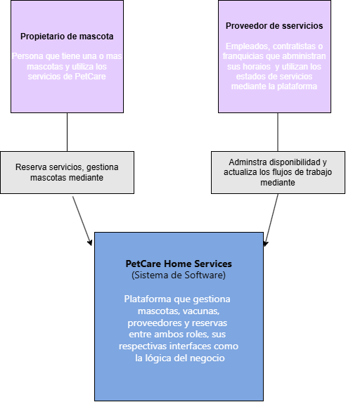
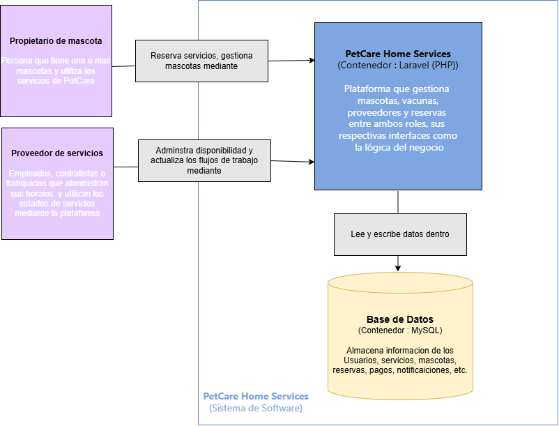
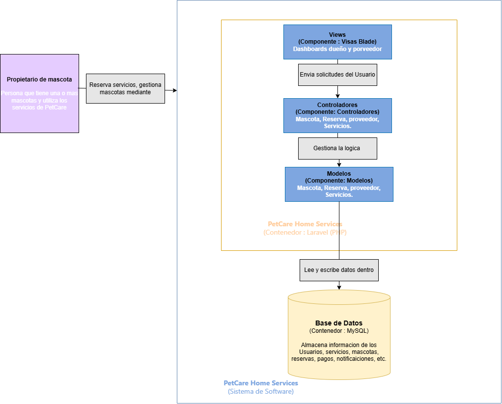

# 🐾 PetCare Home Services

Sistema web para la gestión de servicios y reservas en línea para el cuidado de mascotas.

---

## 📌 Descripción del proyecto

**PetCare Home Services** es una plataforma web desarrollada para una empresa dedicada al cuidado de mascotas.

El sistema permite a los propietarios gestionar sus mascotas y realizar reservas de diferentes servicios, mientras que los proveedores pueden administrar su disponibilidad y gestionar las reservas recibidas.

Entre los principales servicios se encuentran:

- 🐕 Cuidado y atención de mascotas
- ✂️ Peluquería y grooming
- 🩺 Servicios veterinarios
- 🚶 Paseo de mascotas
- 🏠 Servicios a domicilio
- 🏨 Hospedaje de mascotas
- 💉 Registro y verificación de vacunación
- 📅 Gestión de reservas
- 💳 Gestión de pagos
- 🔔 Notificaciones

---

# 🏗️ Arquitectura de Software

Para representar la arquitectura del sistema se utiliza el modelo **C4 Model**, permitiendo describir el sistema desde diferentes niveles de abstracción.

Los diagramas desarrollados son:

1. **C1 — Diagrama de Contexto**
2. **C2 — Diagrama de Contenedores**
3. **C3 — Diagrama de Componentes**

---

# 1. 🌎 C1 — Diagrama de Contexto

El diagrama de contexto representa el nivel más general del sistema y muestra los principales actores que interactúan con **PetCare Home Services**.

### 👤 Propietario de mascota

Persona que posee una o más mascotas y utiliza la plataforma para:

- Gestionar sus mascotas.
- Consultar servicios.
- Realizar reservas.
- Consultar el estado de sus reservas.
- Registrar y cargar información de vacunación.

### 🧑‍⚕️ Proveedor de servicios

Empleado, contratista o franquicia que utiliza la plataforma para:

- Gestionar los servicios ofrecidos.
- Administrar su disponibilidad.
- Consultar reservas.
- Actualizar el estado de los servicios.
- Verificar los requisitos de las mascotas.

### 🐾 PetCare Home Services

Plataforma web encargada de conectar a los propietarios de mascotas con los proveedores de servicios.

El sistema administra:

- Usuarios
- Mascotas
- Servicios
- Reservas
- Vacunación
- Proveedores
- Pagos
- Notificaciones

### 📊 Diagrama C1



---

# 2. 🧩 C2 — Diagrama de Contenedores

El diagrama de contenedores muestra los principales elementos tecnológicos que forman parte de **PetCare Home Services**.

## 🌐 Aplicación Web

La aplicación web está desarrollada utilizando **Laravel y PHP**.

Es responsable de gestionar:

- Autenticación de usuarios.
- Gestión de mascotas.
- Gestión de servicios.
- Gestión de proveedores.
- Gestión de reservas.
- Registro y verificación de vacunas.
- Gestión de pagos.
- Notificaciones.
- Reglas de negocio.

## 🗄️ Base de Datos

El sistema utiliza **MySQL** para almacenar la información de la aplicación.

Entre los datos almacenados se encuentran:

- Usuarios
- Mascotas
- Vacunas
- Servicios
- Proveedores
- Sucursales
- Reservas
- Pagos
- Notificaciones

## 👥 Usuarios

Los principales usuarios que interactúan con la aplicación son:

### Propietario de mascota

Utiliza el sistema para gestionar sus mascotas y reservar servicios.

### Proveedor de servicios

Utiliza el sistema para administrar servicios, disponibilidad y reservas.

### 📊 Diagrama C2



---

# 3. ⚙️ C3 — Diagrama de Componentes

El diagrama de componentes representa la estructura interna de la aplicación Laravel y muestra cómo se organizan sus principales componentes.

## 🖥️ Vistas

Las vistas proporcionan la interfaz mediante la cual los usuarios interactúan con el sistema.

Entre ellas se encuentran:

- Vistas de mascotas.
- Vistas de reservas.
- Vistas de servicios.
- Vistas de proveedores.
- Vistas de vacunación.
- Dashboards.

## 🎮 Controladores

Los controladores reciben las solicitudes realizadas desde las vistas y coordinan las operaciones necesarias.

Entre los principales controladores se encuentran:

- `MascotaController`
- `ReservaController`
- `ProveedorController`
- `ServicioController`
- `VacunaController`
- `VerificacionVacunaController`

## 🧱 Modelos

Los modelos representan las principales entidades del sistema y permiten interactuar con la base de datos.

Entre ellos:

- Usuario
- Mascota
- Reserva
- Proveedor
- Servicio
- Vacuna

## 🗄️ Base de Datos

Los modelos interactúan con **MySQL** para almacenar y consultar la información del sistema.

## 🔄 Flujo principal

```text
Usuario
   ↓
Vista
   ↓
Controlador
   ↓
Modelo
   ↓
Base de Datos

### 📊 Diagrama C3



---